# Quizzers

Quizzers is a website that offer trivia on General knowledge questions.The project is design to help all user old and young be up to date about all things Sport and Geography.It gives a real time Answer to each question.

The QuizIT website also shows how JavaScript works in a real-world context.The site is targetted toward everyone who is inquisitive and looking for a challenge.QuizIT is a fully responsive website .

<h2 align="center">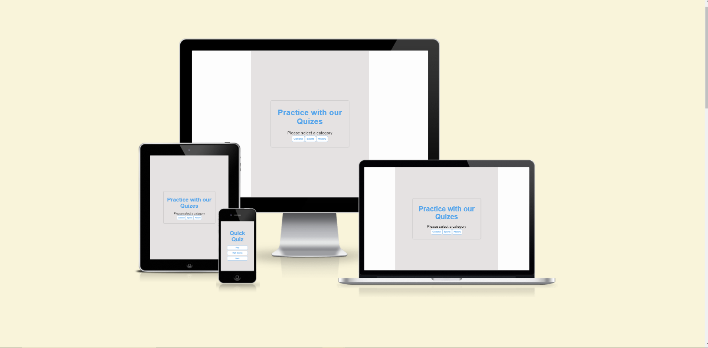</h2>

[View the live project here.](https://diddyjax19.github.io/Quizzers/)

# User Experience (UX)

  - User stories

    - First Time Visitor Goals

      a. As a First Time Visitor, I want to easily understand the main purpose of the site and learn more about the Website.
      b. As a First Time Visitor, I want to be able to easily navigate throughout the site to find content.
      c. As a First Time Visitor, I want to be able to enjoy the game

    - Returning Visitor Goals.

      a. As a Returning Visitor, I want to find information about fdifferent game trivia.
      b. As a Returning Visitor, my previous score is store and i can all my score.
      

    - Frequent User Goals.

      a. As a Frequent User, I want to test my knowledge on trivia questions.
      b. As a Frequent User, I want to Add a username to log my name into the system.
      b. As a Frequent User, I want to see other player score compared to mine.

### Existing Features

__The QUIZZEERS Home Page__

  - This page is the welcome page,it serves as the landing page for all users.On this page the User can see what the name of the App and the instruction.Also they can see the available catergories avaliable.

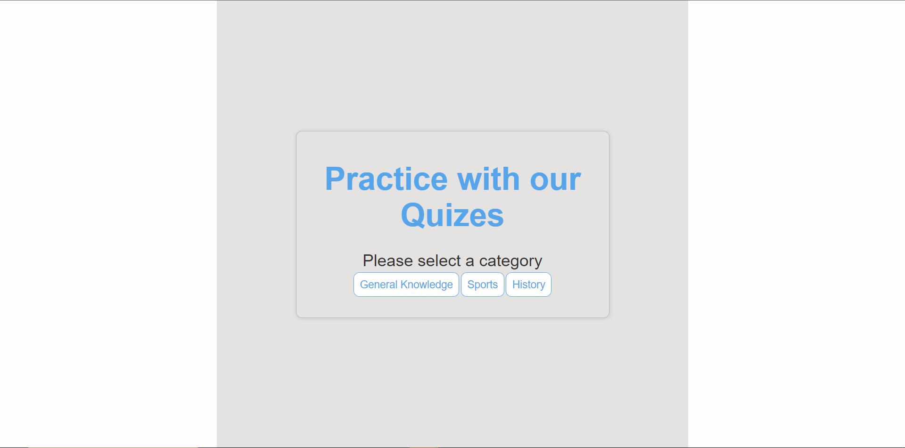

 __Categories__

- This Stage occurs immediately the user has selected a category to play from,he is then redirected to a menu that gives him 3 options.
(1) Play
(2) Check HighScores of that Category 
(3) Go back to the Main menu to select a different category.

  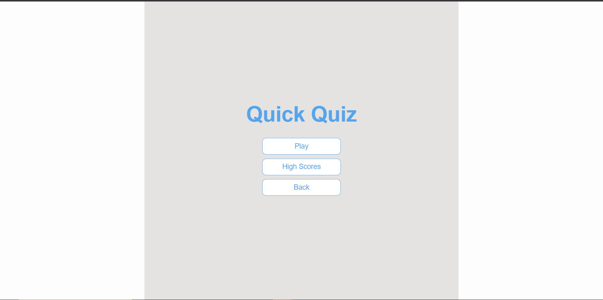

  __The Quiz Area__

- The Quizzer game can be played in this area. The user will find it simple to read the questions and choose the appropriate response from the choices A to D. This Section has a progress bar that shows the user the questions Answered and how many questions left,it also has a score board that shows the score.

  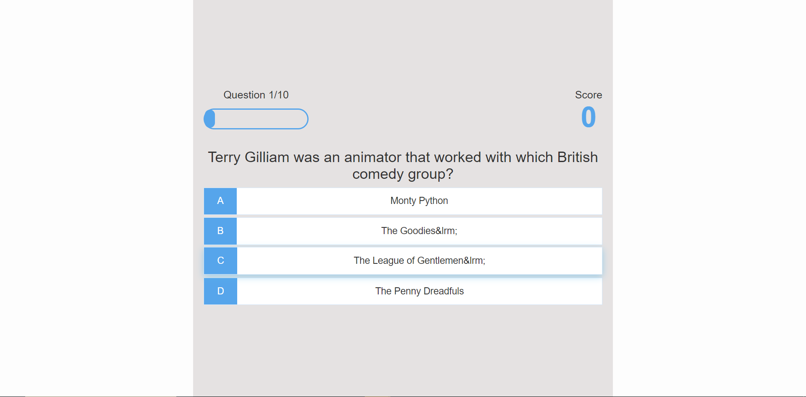

- __The Username Area__

  - - This is at the end of the game,the User has the option to choose to log his username or play again or go back to the Landing page .

  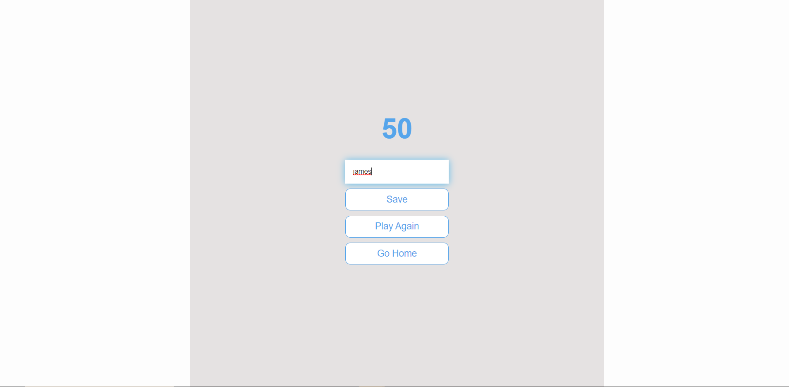

- __The High Scores__

  -  This section reveals the score of the user and the other players that have played the game.It also has a dropdown menu that has all the categories and thier username and score. There is also an Home button to take you to the landing page.

  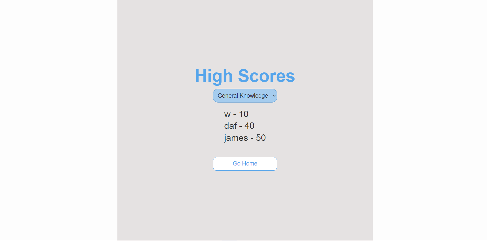

 __The Full View HighScore Page__

  - This is just a screenshot of how to select from each category and select see the high Score..

  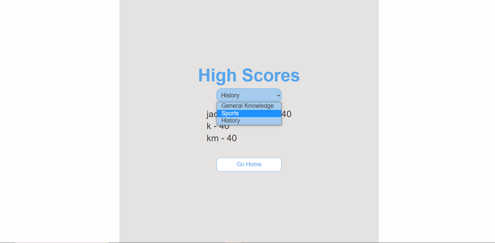
  
  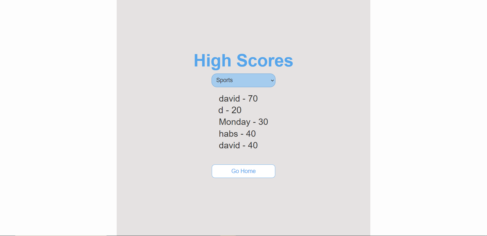
  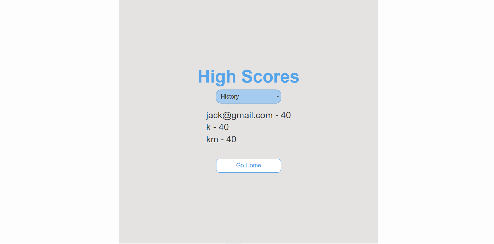

  __The Wrong and Right Question__

  - In the Quiz if a user is right,the answer he selected is highlighted green but if he is wrong it is highlighted red.

  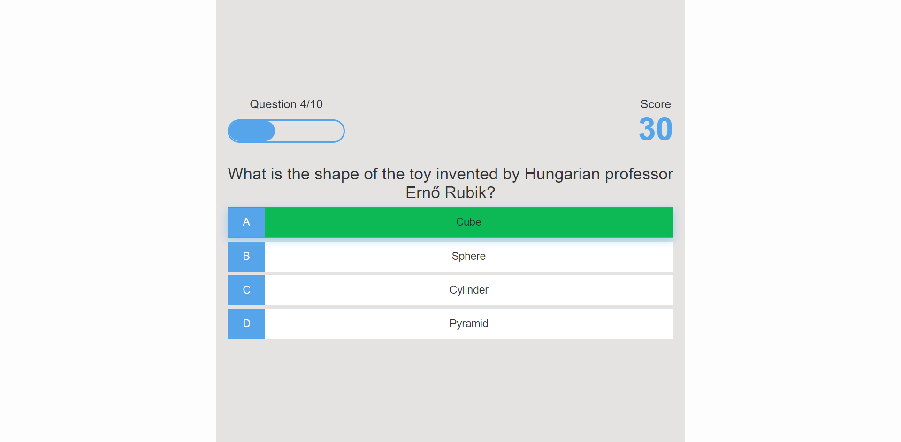
  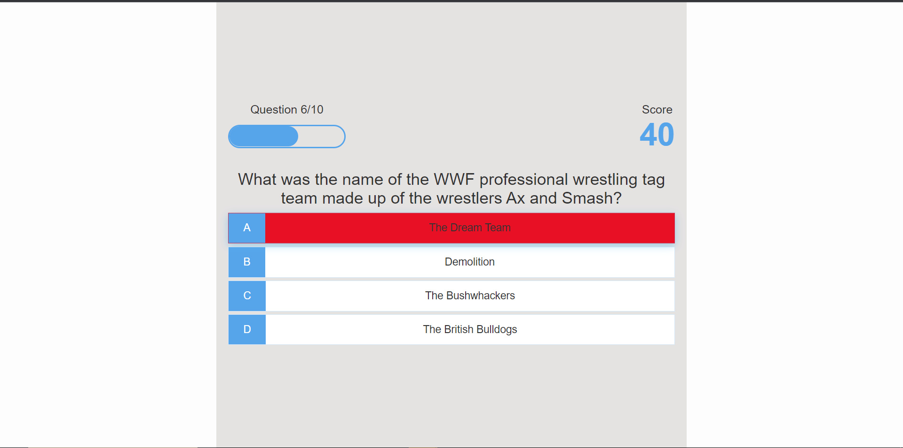
 

### Validator Testing 

- HTML
    - No errors were returned when passing through the official 
      [W3C validator]
        [Landing Page](https://validator.w3.org/nu/?doc=https%3A%2F%2Fdiddyjax19.github.io%2FQuizzers%2Findex.html)
      [W3C validator]
        [Quiz Page](https://validator.w3.org/nu/?doc=https%3A%2F%2Fdiddyjax19.github.io%2FQuizIT%2Fquiz.html)
      [W3C validator]
        [High Score](https://validator.w3.org/nu/?doc=https%3A%2F%2Fdiddyjax19.github.io%2FQuizzers%2FhighScores.html)

- CSS
    - No errors were found when passing through the official 
      [(Jigsaw) validator]
        [Home Page](https://jigsaw.w3.org/css-validator/validator?uri=https%3A%2F%2Fdiddyjax19.github.io%2FQuizIT%2Findex.html&profile=css3svg&usermedium=all&warning=1&vextwarning=&lang=en)
      [(Jigsaw) validator]
        [Quiz page](https://jigsaw.w3.org/css-validator/validator?uri=https%3A%2F%2Fdiddyjax19.github.io%2FQuizIT%2Fquiz.html&profile=css3svg&usermedium=all&warning=1&vextwarning=&lang=en)
      [(Jigsaw) validator]
        [Congratulation Page](https://jigsaw.w3.org/css-validator/validator?uri=https%3A%2F%2Fdiddyjax19.github.io%2FQuizIT%2Fend.html&profile=css3svg&usermedium=all&warning=1&vextwarning=&lang=en)

      
- JavaScript
    - No errors were found when passing through the official [Jshint validator](https://jshint.com/)
      - The following metrics were returned: 
      - There are 15 functions in this file.
      - Function with the largest signature take 1 arguments, while the median is 0.
      - Largest function has 16 statements in it, while the median is 3.
      - The most complex function has a cyclomatic complexity value of 9 while the median is 1.
                Three unused variables
                  88	handleNextQuestion.
                  148	closeScoreModal.
                  159	closeOptionModal.

  - Accessibility

  - I confirmed that the colors and Fonts chosen are easy to read and accessible by running it through Lighthouse in Devtools

    <h2 align="center">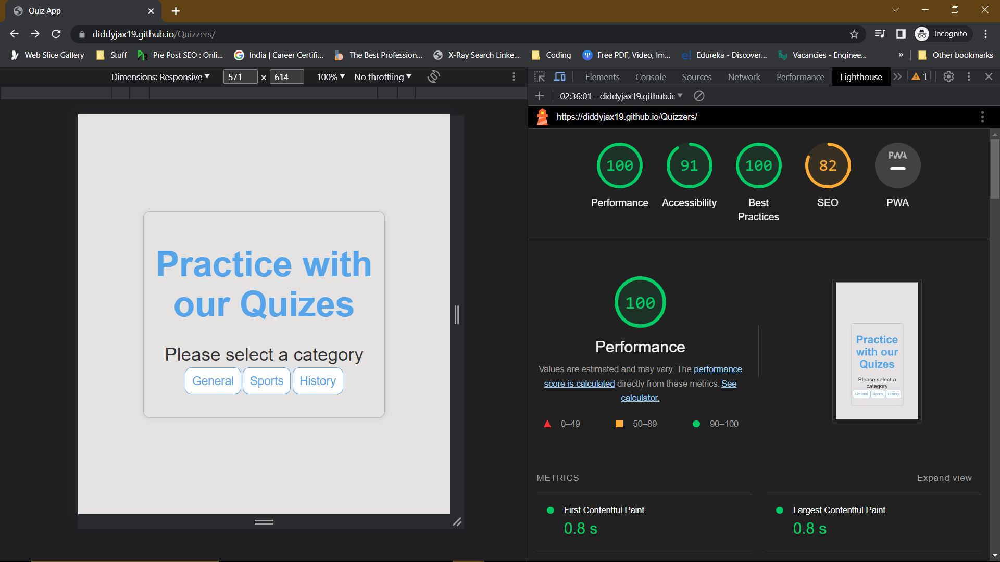</h2>
### Further Testing

-   The Website was tested on Google Chrome, Internet Explorer, Microsoft Edge and Safari browsers.
-   The website was viewed on a variety of devices such as Desktop, Laptop, iPhone7, iPhone 8 & iPhoneX.
-   A large amount of testing was done to ensure that all pages were linking correctly.
-   Friends and family members were asked to review the site and documentation to point out any bugs and/or user experience issues.

### Testing User Stories from User Experience (UX) Section

-   #### First Time Visitor Goals

    1. As a First Time Visitor, I want to easily understand the main purpose of the site and learn more about the organisation.

        1. Upon entering the site, users are automatically greeted with a clean and easily readable Welcome page.
        
        2. The user has 3 Categories to select from
          a. General Knowledge.
          b. Sport
          c. History
      

    2. As a First Time Visitor, I want to be able to easily be able to navigate throughout the site to find content.

        1. The site has been designed to be fluid and never to entrap the user. At the top of the page there is a clear and precise Heading of the Trivia Game.
        2. Also the USer See the rules and what he need to do to access the game.
        

    3. As a First Time Visitor, I want to look be engaged by beautiful graphics and Challenging questions.
-   #### Frequent User Goals

    1. As a Frequent User, I want to check to see if there are any newly added trivia

        1. The user would already be comfortable with the website layout and can easily click the banner message.

    
  
-  #### Known Bugs

  - i noticed that when the questions load,they tend to be scrambled,due to the api i added to my code.
  - when deploying they was a serious lag during deployment.

## Deployment

1. Log in to GitHub and locate the [GitHub Repository](https://github.com/)
2. At the top of the Repository (not top of page), locate the "Settings" Button on the menu.
3. Scroll down the Settings page until you locate the "GitHub Pages" Section.
4. Under "Source", click the dropdown called "None" and select "Main".
5. The page will automatically refresh.
6. Scroll back down through the page to locate the now published site [link](https://diddyjax19.github.io/Quizzers/) in the "GitHub Pages" section.
The live link can be found here - https://diddyjax19.github.io/Quizzers//

### Credit 

- Content

    - The Qestions for the Home page was taken from https://opentdb.com/api_config.php.

    - Instructions on how to implement form validation on the Sign Up page was taken from w3schools.

    - The code used to make the footers in all the files where gotten from love running project.
    
    - Most code used to make the body in all the files where gotten from love math project.
    
       

#### Colour Scheme

 - The colours used are In QuizIT Websites are blue,grey,red,green and white

 - In order to pick the background and text color i used the color grid  tool [Color Grid](https://contrast-grid.eightshapes.com//HTML5) . This provide appropriate information to make a better decision when choosing my colors.
   

#### Typography
   -   The Roboto font is the main font used throughout the whole website with Sans Serif as the fallback font in case for any reason the font isn't being imported into the site correctly. 

- [Font Awesome](https://fontawesome.com/)
    - The icons in the footer were taken from 
- [Google Font](https://fonts.google.com/)
    - The Fonts in this website are gotten from google font 
- [Git](https://git-scm.com/)
    - Git was used for version control by utilizing the Gitpod terminal to commit to Git and Push to GitHub.
- [GitHub:](https://github.com/)
    - GitHub is used to store the projects code after being pushed from Git.

### Languages Used

- [HTML5](https://en.wikipedia.org/wiki/HTML5)
- [CSS3](https://en.wikipedia.org/wiki/Cascading_Style_Sheets)
- [JavaScript](https://en.wikipedia.org/wiki/JavaScript)

### Acknowledgements

- My Mentor for continuous helpful feedback.

- Tutor support at Code Institute for their support.

